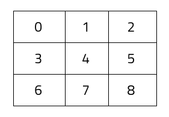
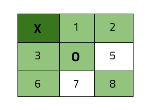
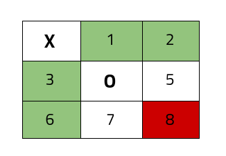
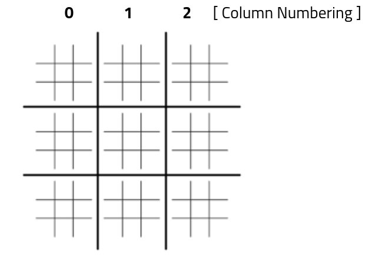
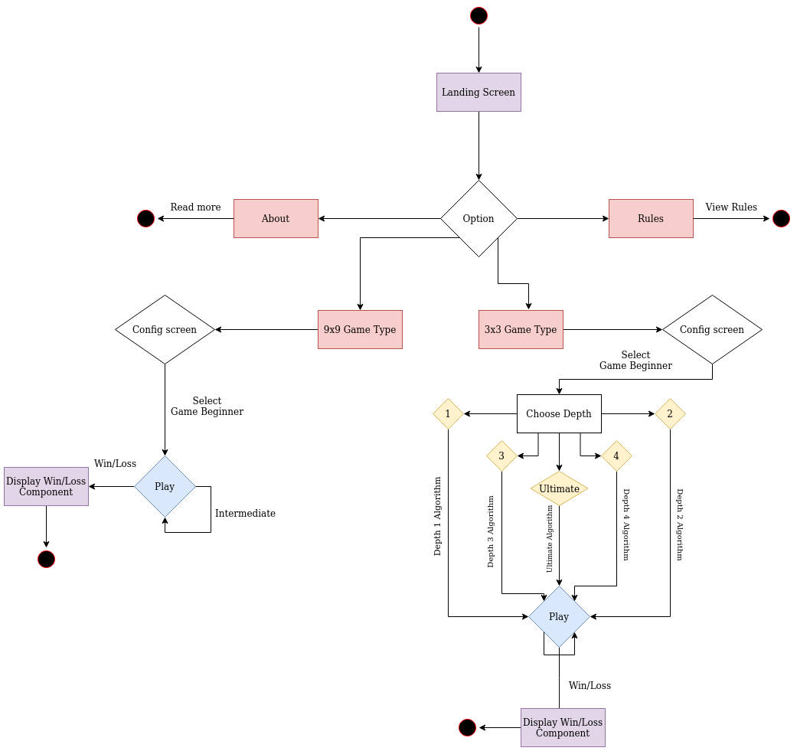

# TicTacToe

## Description
In order to build this game, we have made use of the *Minimax* algorithm. This is a recursive algorithm that enables the AI agent to choose the most optimum move based on all the subsequent moves that could take place in the further turns of the game. 

In the 3x3 version , there are a total of 4 difficulty levels and the ultimate TicTacToe that is unbeatable. Each of these difficulties has a gradual increase in the smartness of the agent/computer that finally reaches the unbeatable agent. In the 9*9 version there is only one level of gameplay. Here taking into consideration the tradeoff between the response time of the agent and the smartness, the agent is not unbeatable but doesn’t play mindlessly either. 

## Technology Stack

**Frontend - ReactJS (Javascript),Bootstrap4 :** 

React was chosen as a framework choice of choice dues assignments eequirements and its convenient development environment. The virtual DOM used by ReactJS facilitates that the frontend is well decoupled and updation of each component happens independent of the other. This also helps in faster development. The hot reload feature of React is another added advantage.

**Backend - Flask Framework (Python):**

All the algorithmic code for the moves taken by the agent throughout the gameplay are written in python. We chose to use a backend and frontend segregation of code to have modularity and segregation of the two domains of work and more importantly to ensure that the logical component of the application - algorithms used, optimizations, OOPS concepts used etc remain cryptic from the user.

## Features of the Application

1. **3X3 tic-tac-toe with 5 different levels :**  
The 3x3 tic-tac-toe is built with incremental levels of difficulty. A different algorithmic approach is used to attribute smartness to the agent at each level. The ultimate level is unbeatable and will always result in either a WIN of the agent or a TIE.

2. **9X9 tic-tac-toe game :** 
The game is further extended to include an extreme version tic-tac-toe. This 9x9 version follows the standard rules of the gameplay. Decisions on how the agent has been trained to respond in a decent amount of time as well as take sensible decisions has been mentioned in the later sections in detail.

3. **Light and dark mode toggle**  
The application can be used in 2 modes as per user requirement, a light and a dark mode. These themes are available while playing the game only. A toggle icon is available on the game board screen that allows users to do so.

4. **Responsiveness on different Platforms** 
The application is built such that it is responsive and can be used across various sizes of devices - mobiles, tablets, monitors and desktops. Furthermore the app has been tested on browsers including firefox, chrome, edge, to name a few.

5. **Undo Moves** 
This feature allows users to revert back their moves upto a particular move. The gameplay would then begin from that move. This is only in the 3x3 games.

6. **Hint Boxes** 
For the 9x9 game, the users are provided with hint boxes that appear with a message containing the next board they have to place their move in. The alert boxes also appear in cases of incorrect/invalid moves.

7. **Past Score Records** 
The application also consists of a page where a user can view their Past Games’ results. The records include the Game type (3x3 or 9x9), the game level, and the result.

8. **Friendly User Interface :** 
Throughout the application we have tried to keep the UI as convenient and intuitive as possible. Keeping in mind the Mars Rover concept of the project, we have incorporated a space theme to our design.

9. **Comfortable gameplay** 
The application also consists of an indicator on the top bar of the board denoting who's turn it is. In case of the 9x9 gameplay, since the agent may take a couple of seconds to respond, a loader has also been included for the users to notice the same.

10. **Error page [For incorrect URLs]** 
We have accounted for cases wherein the user may try to access an undefined route. In such cases we have included a custom 404 error page.

11. **Sound effects** 
We have also included fun audio effects that add to the overall experience of the gameplay for a user.

12. **Browser support** 
The application has been tested on the browsers : Firefox, Chrome, Edge and Safari.

## 3x3 TicTacToe

Our idea revolves around directing the AI agent (in this case the computer) to choose a move based on the utilities of the immediate next moves available to it. The agent must pick the maximum of these utilities for the next move.

As mentioned in the project demo instructions that were given with the problem statement the game must have a set of **complexity levels**. In our implementation , every complexity level has **depth** : how *deep down the recursive tree* will the agent be allowed to proceed before it can backtrack to its current configuration and make a decision for the next move , where every board configuration is associated with a **custom utility function**

## Numbering Convention

There are 9 cells in 3*3 tic-tac-toe board, which are numbered sequentially from 0 to 8.

## Rules for 3x3

* Start by selecting a depth and a player who shall begin the game
* The robot and the human play in alternation
* First person to get their symbol across an entire row, column or diagonal wins

## Analysis of each Complexity Level

As mentioned above in each of the complexity levels, a custom version of the minimax algorithm is run, with two varying factors depth and utility function . 
    
**Depth (Difficulty Level)**: If the complexity level is X ,  the agent can explore nodes (or board configurations) that are up to a X hop distance from the current state of the board. 

For example : With complexity level = 2 , the agent can explore nodes (or board configurations) that are up to a 2 hop distance - that is 2 levels deep - from the current state of the board.

**Utility Functions**

a) *Complexity Level1*

At complexity level 1, the agent is extremely naive . Since the agent can choose only amongst the nodes that are at a one hop distance in the recursive tree, we assign the same utility to all the possible board configurations from current configuration and a **random** function that arbitrarily selects one of the empty cells for the agent to make its next move.

b) *Complexity Level2*

At level 2, the agent’s smartness is increased and a new function is used to compute the utilities of the next states. The agent can now look at upto 2 levels deep from the current state. The function we have considered here is the number of **crossover win states** that a particular empty cell can contribute to. That is given a cell on the board, how many win configurations can it be a part of.

For instance, suppose the agent is about to place its move in the cell [0], if permitted, it can win in three ways 
* Horizontally : by placing in cells 1 and 2 
* Vertically       : by placing in cells 3 and 6 
* Diagonally    : by placing in cells 4 and 8 

So , we give this board a utility=3 similarly, a board when about to place in  
cell[1] and utility 2 , cell[4] a utility 4  and so on. Further, in this level, if the agent can
acquire a **win state** with a particular move, we have ensured that the agent takes that
path with certainty. This is done by pumping up the utility for that node and **reflecting**
this in all the previous nodes while backtracking. If the maximum utility is achieved by
multiple configurations then we choose one among them .

c) *Complexity Level3*

At level 3, there is an extension to the strategies of level 2. As expected, the agent can now explore upto 3 depths from its current configuration. Apart from the crossover win states, we now allow the agent to look for **only agent’s win configurations** and boost the utilities for those states so that the agent favours them more.

For eg :  Here with just cross overs the agent may tend to place its next move in cell 2 ,6 or 8 . If it chooses 8 , it doesn’t gain any immediate advantage with this, hence the agent will be directed to placing its next move in cell 1 or cell 3 or cell 2 or cell 6 thereby increasing its chances of winning .

d) *Complexity Level4*

At level 4, the agent now can look upto 4 depths, adopts all the strategies of level 2 and 3, and additionally now also tries to block the human player from 
winning. So it now also looks at moves that can cause the **human to lose**, thereby further increasing the ability of the agent to think.

For example : consider the configuration below , just but applying to the custom utility function of complexity level 3 it would have placed in cell[1] / cell[2] / cell [3] / cell [6] If it does to the human will win , so as to stop the human from winning the utility function is written so that the agent places in cell[3] 

## Analysing the 3x3 Ultimate TicTacToe

For the ultimate tic tac toe, we have used the *Minimax algorithm*. The agent traverses the entire tree until the leaf node[End of the game : Win/loss/Tie] and only then makes a choice. This ensures that the agent will **definitely** take a move that either results in it’s win or a tie. The algorithm is written considering that the human also plays optimally. 

Furthermore, we have incorporated an optimization layer as well. We have **precomputed** the move for all the configurations of the board - that is the nodes of the tree - and have stored them in a custom data structure beforehand. Since the minimax algorithm is fixed and the configurations of the board are also finite, we can repeatedly use the same move values every time a new game is played for the “ultimate” level. 

## 9x9 Ultimate TicTacToe

The 9x9 tic-tac-toe follows the standard rules of gameplay wherein :

* Once a player places his icon in a cell (i,j) of a local board, the next player must place their next icon in the (i,j)th local board of the global board. In case that local board already has achieved a win state, the player can place their symbol in any of the empty cells on the entire global board. 

* Once a local board has achieved a win state, no more moves will be allowed to occur in that local board. 

* To achieve a global win, a player must win in 3 local boards either row-wise, column-wise or along the diagonals.

## Naming Convention

* **Global Board** : 
The entire board 
    Numbering : Row and column numbering starting with 0 . 

* **Local board**   : 
Each cell in the global board , which is 3*3 tic-tac-toe board 
        Numbering : Row and column numbering starting with 0 . 

While designing the agent for this extreme tic tac toe version, we have a trade-off between the smartness and the response time. This is primarily because, both the depth and the breadth of the recursion tree that is to be explored now is larger in the case of 9x9. The root node itself would have 81 possibilities and the leaf nodes would extend upto **81! combinations**. It would take **hours to compute** the best move!

Thus, in order to optimize the search for the best move that the agent can take from a given board configuration, we have considered the following  methods : 

1. **Alpha Beta pruning** : We have assigned utilities to the different configurations in the game tree via the minimax algorithm. On exploring some paths in the tree we realise that they are in fact unnecessary since the utility of a node may compel it to completely ignore that path. Hence via pruning, we have cut off such paths, hence reducing the search time.

2. In order to reduce the response time we have **restricted the search depth** of the agent to 5 levels. As a result, the agent may not always reach a win state and the score of an intermediate state is to be returned. Utilities to these intermediate depths are given by recycling code from **3x3 DEPTH4 strategy** of calculating the score.

3. Utility of the global board is obtained by summing utilities of all the small boards. Furthermore, for every configuration where a move has to take the next move, the only local board that has to be explored depends on the previous configuration move. Hence all the other branches from this node of the tree are redundant and are unnecessary computations. Hence we omitted these computations as well. 

Even while computing the utility also we made use of the utilities of the parent configuration (i.e the previous move configuration ) . More elaborately , the utility is calculated only for the local board then subtracted/added from previous move configuration’s utility and then assigned to current board configuration . **This reusing of utility of previous move configuration reduced the computations by 8/9 percentage .**

Collectively, there isn't a 100% guarantee that the agent will win. But the agent doesn't play mindlessly either. It's likely that agent wins/ tie .The response time with these optimizations was brought down from over 90s to less than 10s.

## State Diagram

